by EricSanchez


- [一、前言](#一前言)
- [二、理论基础](#二理论基础)
- [三、项目分析](#三项目分析)
- [四、工程文件](#四工程文件)
- [五、双目相机标定](#五双目相机标定)
  - [相机标定目的](#相机标定目的)
  - [相机标定规范](#相机标定规范)
- [六、立体校正](#六立体校正)
- [七、立体匹配与三维点云](#七立体匹配与三维点云)
- [八、特征提取](#八特征提取)
- [九、卷积降维操作](#九卷积降维操作)
- [十、可视化](#十可视化)
- [十一、题外：三角测量](#十一题外三角测量)
- [十二、总结](#十二总结)


## 一、前言

读研以来，一直在忙东忙西，很久没有做过一个比较完整的项目了，借着《机器视觉》这门课的结课作业，刚好实验室里有一个小任务需要用到，把双目立体视觉的流程走了一遍，特此记录下来。

项目用到的相关技术都是非常基础的，并且由于是具体的应用实战，源码不会有很强的通用性，但是流程是大差不差的。


## 二、理论基础

**==如果真的希望做好一件事，学习充足的理论基础是非常必要的 #EE3F4D==**，关于三维重建的相关理论知识，知乎的一位博主讲的已经写好了一系列的博客，思路非常清晰，可以学习参考：
[三维重建1——相机几何模型和投影矩阵](https://zhuanlan.zhihu.com/p/458000359)
[三维重建2——相机几何参数标定](https://zhuanlan.zhihu.com/p/462757273)
[三维重建3——两视图几何](https://zhuanlan.zhihu.com/p/463289634)
[三维重建4——立体校正(Recitification)](https://zhuanlan.zhihu.com/p/466365225)


## 三、项目分析

当你接手了一个双目视觉项目时，最先要做的是对任务进行具体的分析，比如：

* **测量的对象是谁？有哪些特征？**
* **工作距离处在什么范围？**
* **工作环境是怎样的？**
* **有无实时性的要求？**
* ......


**这些分析会直接决定相机该如何选型、要做到什么程度、用到哪些方法以及整体的难易度**。


一开始时的任务是测量如下图所示的导丝(==直径0.4mm #EE3F4D==)在三维空间中的坐标，==工作距离约为20~30cm #EE3F4D==：

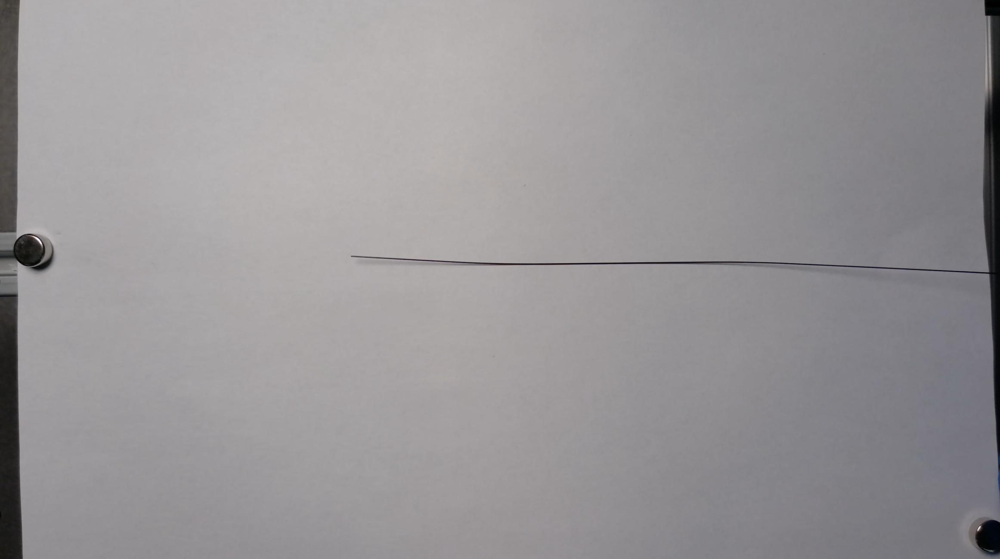

经过我的计算，为了能够让如此细的导丝在图像中能够多占据几个像素，我选择了两个8000x6000的工业相机(丧心病狂，实际上最后通过降采样只用了800x600)。

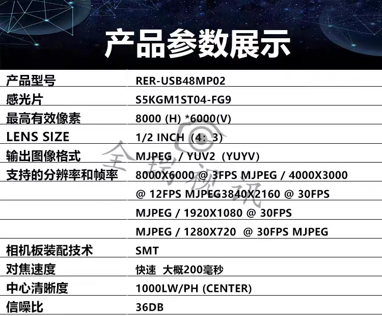

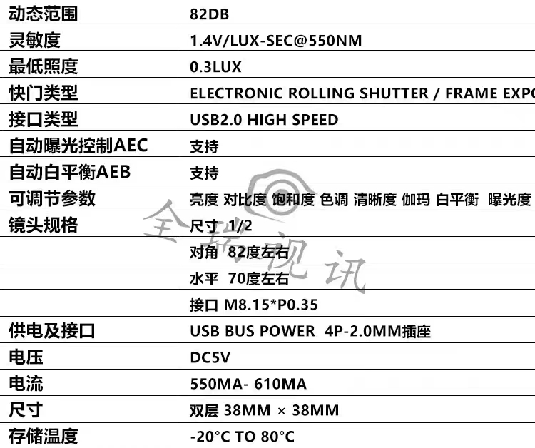

但是导丝的检测搁置了，最后变成了检测导管的三维位置，导管的直径约为==3mm #EE3F4D==，因此也就不再需要那么高的分辨率，==800x600完全够用 #EE3F4D==。

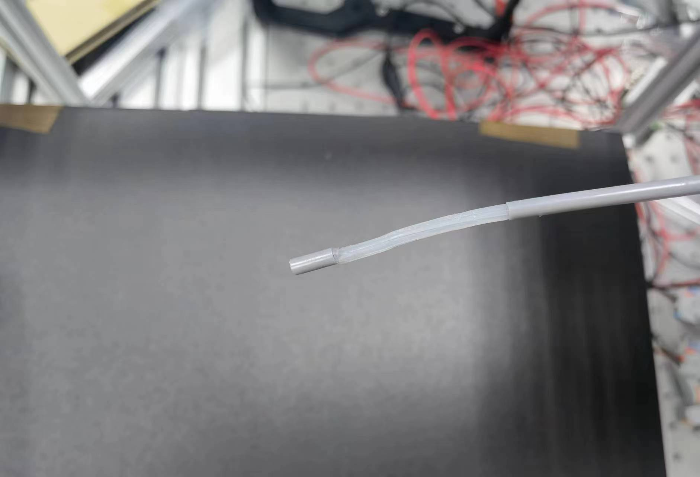

==注意 #EE3F4D==：分辨率增大的同时带来的不仅仅是帧率的下降，通常计算视差图的算法适配的图像尺寸比较低，如果你使用超高分辨率的图像，你的视差图的效果有可能会很差。

最终搭建好的工作环境如下图所示：

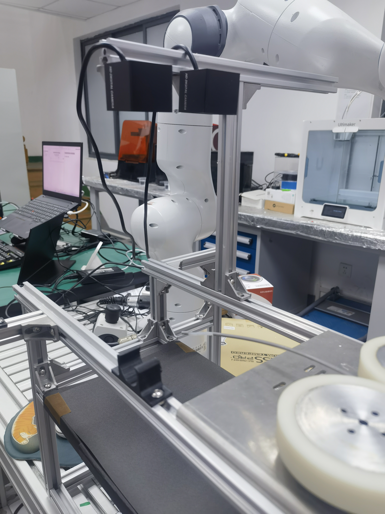

要检测的导管处于相机的正下方，并且导管的轴向方向是==沿着相机的y轴布置 #EE3F4D==，为什么这样做呢？

实际上**在项目后期我们才意识到，应该将相机的y轴和导管的方向对齐，这一步是极其关键的**。因为在计算视差图(立体匹配)之前，要进行立体矫正，这一步的目的是将两幅图像的极线对齐，使得同一对特征点的y相同，这样我们计算视差匹配特征点时只需要沿着x轴进行窗口滑动即可。

可以看下图，导管沿着相机y轴布置，这样你在沿着x轴进行匹配时，左图与右图的导管是很容易匹配上的，然而，如果导管沿着x轴布置(即将导管横过来)，在算法进行x轴滑动时，由于导管水平布置，而导管上各个点的相似度很高，因此误匹配的可能性非常大，计算出来的视差图非常糟糕，这是这次项目踩过的最大的坑。


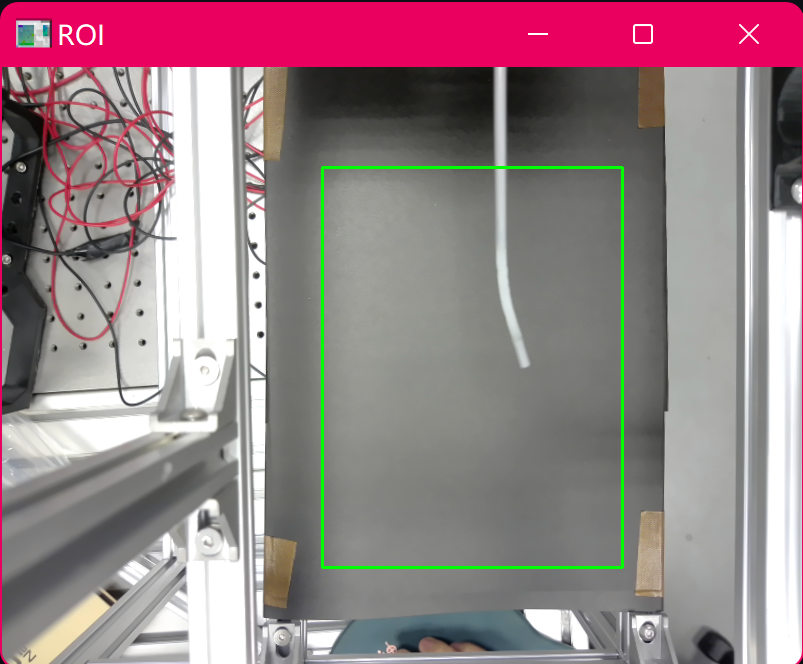


## 四、工程文件


完整的项目文件已经上传至GitHub上：[Eric的工程文件](https://github.com/EricSanchezok/StereoVision.git)

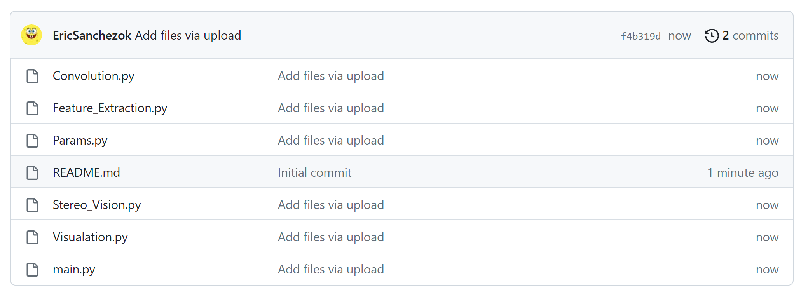
``` markdown
main.py：主函数

Params.py：包含标定好的相机内参外参、SGBM算法参数以及一些全局参数等。

Feature_Extraction.py：包含对导管进行颜色识别、骨架提取等操作的函数。

Stereo_Vision.py：包含对左右相机的图像计算视差图、三维点云计算等函数。

Visualation.py：包含对结果进行可视化的函数。

Convolution.py：对骨架图像进行卷积操作，数据降维。

```


## 五、双目相机标定

### 相机标定目的

很多博主都会先进行单目标定得到内参，再进行双目标定得到外参，几乎没有人解释过为什么这样做。实际上在matlab中无论是单目标定还是双目标定，都可以获得相机的内参。我也没有做过测试，难道是单目标定的内参更加精确？

因此==本项目虽然同时进行了单目标定和双目标定，但在最后应用时只使用了双目标定的结果 #12AA9C==，而双目标定的目的就是：

1. 获得相机内参和畸变：K、D
2. 获得两相机间的旋转和平移矩阵：R、T


### 相机标定规范

网上有很多帖子详细地介绍了相机标定过程中该注意哪些规范事项，比如：[点击这里](https://mp.weixin.qq.com/s/HnNXEA_tRfna5BuZ3dvIAA)

在我的实践过程中，我认为有以下几点是非常关键的：
1. ==最好使用专业的标定板(浮法玻璃或者铝板) #41AE3C==：在项目进行中我做过多次的标定，在一开始我用的是A4纸打印的棋盘格，这种打印的标定板对于内参中的fx,fy,cx,cy的精度是足够的，但是由于A4纸很软，如果摆放的不是非常平坦，对于畸变参数还是有较大的影响的。

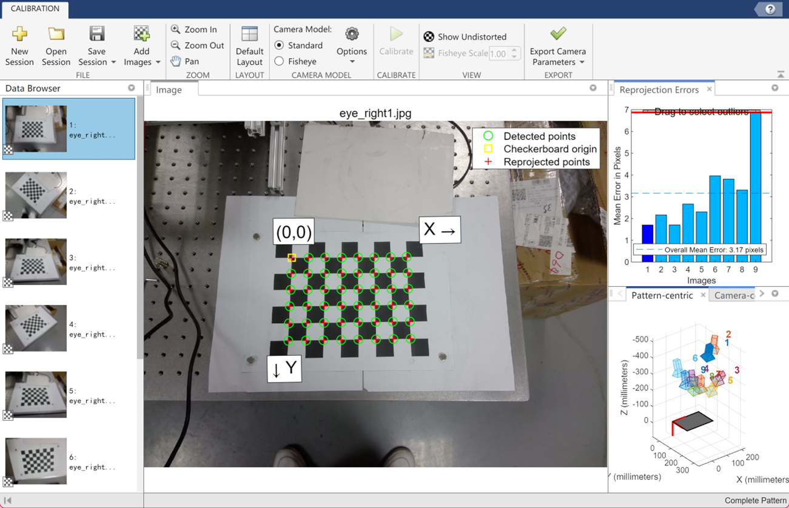

2. ==拍摄标定图片时可以调整像距，但是不能调整物距 #12AA9C==：如果你的相机可以自动对焦，那么在拍摄图片是不要担心相机的自动对焦问题，而如果你的相机有镜头，在拍摄图像时如果出现离焦，是不允许调整镜头来获得清晰的图像的，只能通过调整标定板的距离和像距进行清晰对焦。
3. 标定时的光照尽可能的均匀，不能过曝或者欠曝。
4. 标定的图片数量在15~25张左右，不能太少，也没必要太多。
5. 标定板在图像中的占比刚刚好就可以，不需要太大也不需要太小，感觉这个影响并不是很大。
   
标定过程没有什么可讲的，使用matlab的stereo camera工具包进行标定即可

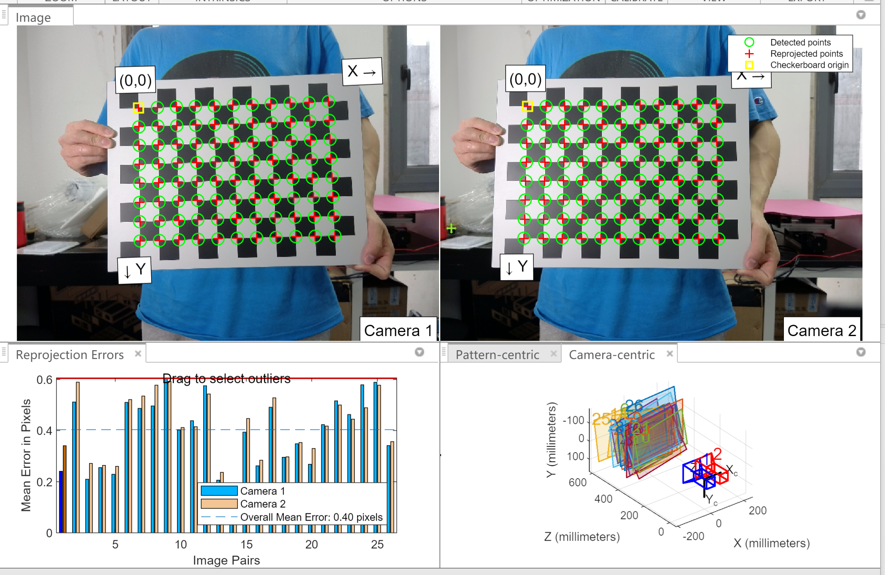
将标定好的结果写入Params.py中

``` python
# 相机内参矩阵
K1 = np.array([[603.203230962510, 0, 0],
               [0, 603.282035569803, 0],
               [400.442038630029, 301.405795942410, 1]], dtype=float).T

D1 = np.array([0.0846, -0.1510, 0, 0, 0], dtype=float)

K2 = np.array([[605.360594316701, 0, 0],
               [0, 604.975943329530, 0],
               [400.089763847830, 299.044031919448, 1]], dtype=float).T

D2 = np.array([0.0886, -0.1568, 0, 0, 0], dtype=float)

R = np.array([[0.999034572196626, 0.0257176721743424, -0.0356163571107109],
              [-0.0258012805637891, 0.999665305337157, -0.00188976888444957],
              [0.0355558360494205, 0.00280689207150011, 0.999363749532534]], dtype=float).T

T = np.array([[-77.7771596068266], [-1.01312800155798], [2.62572217808557]], dtype=float)

F = np.array([[-8.97965080103296e-08, -7.17241155026077e-06, 0.000498161266153330],
              [-5.33652440999904e-07, -1.32009826881906e-06, 0.129244355632227],
              [-0.00153924655477953, -0.125656116896911, 0.253033715598527]], dtype=float)

E = np.array([[-0.0327896857626352, -2.61938744612640, -1.02887295018107],
              [-0.194742286493101, -0.481797741783444, 77.8197334860518],
              [-1.04641211072644, -77.7754173526746, -0.449957959277595]], dtype=float)

RNew = cv2.Rodrigues(R)[0]  # 旋转矩阵
size = (800, 600)  # 图像尺寸

# 立体校正
R1, R2, P1, P2, Q, validPixROI1, validPixROI2 = cv2.stereoRectify(K1, D1, K2, D2, size, R, T, alpha=0)

# 计算畸变校正的映射关系
mapLx, mapLy = cv2.initUndistortRectifyMap(K1, D1, R1, P1, size, cv2.CV_32FC1)
mapRx, mapRy = cv2.initUndistortRectifyMap(K2, D2, R2, P2, size, cv2.CV_32FC1)
```

可以看到**在最后几行中我们预先计算好了要使用的参数，mapLx, mapLy等是进行立体矫正要用到的参数，重投影矩阵Q是从视差图中计算三维点云时用到的参数**。


## 六、立体校正

立体校正是为了将左右两幅图像进行对齐，让==同一特征点尽可能只有x轴上的差，这样才能利用对极几何中的原理得到深度数据 #EE3F4D==。

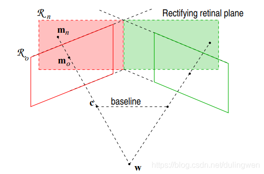

经过==Params.py==中的**mapLx**, **mapLy**等参数只需两行代码即可完成立体校正

``` python
imgL_rectified = cv2.remap(frameLeft, P.mapLx, P.mapLy, cv2.INTER_LINEAR)  # 左图像校正
imgR_rectified = cv2.remap(frameRight, P.mapRx, P.mapRy, cv2.INTER_LINEAR)  # 右图像校正
```


实际上矫正前后的图像变化并不大，是因为本身相机的摆放摆的就比较好。但是如果你观察图像的一些边缘信息，比如最下面的一条线偏右的位置有一颗螺丝，校正前并没有在一条线上，然而校正后就处于了一条线上了。

 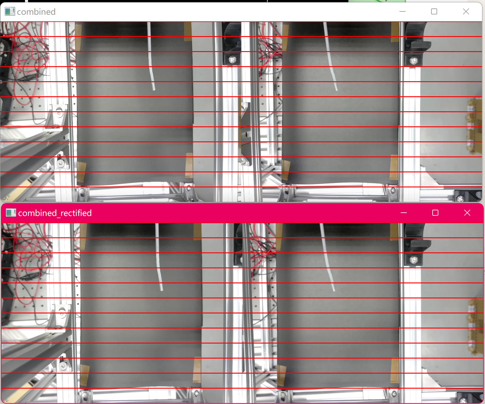
 
 真正要绘制极线需要费点力，我们这里直接就水平的绘制直线，观察一下是否在同一条水平线上就可以了，当做完立体校正后，接下来就是计算视差图了。
 
 
 ## 七、立体匹配与三维点云
 
 立体匹配则是在左图(大部分都是以左图为主)中选择一个点，找到与其对应的在右图中的特征点(同一水平线上)，最后得到视差:`!$ \ disparity = \ x_i - x_j\, $`
 
 有很多种立体匹配算法，本项目最终使用了SGBM算法，在==Stereo_Vision.py==文件中代码如下:
 

``` python
import cv2
import Params as P
import numpy as np

def get_point_cloud(disparity, Q):
    """
    根据视差图和投影矩阵计算深度图

    Args:
        disparity: 视差图
        Q: 投影矩阵

    Returns:
        Points3D: 三维点云
    """

    Points3D = cv2.reprojectImageTo3D(disparity, Q, handleMissingValues=True)  # 根据视差图和投影矩阵计算三维点云

    return Points3D


def imgsTodisparity(frameLeft, frameRight, SGBM_parameters: P.StereoParamsInit, debug=False):
    """
    将左右图像转换为视差图和三维点云

    Args:
        frameLeft: 左图像帧
        frameRight: 右图像帧
        SGBM_parameters: 立体匹配算法参数
        debug: 是否启用调试模式

    Returns:
        disp: 视差图
        ThreeD: 三维点云
    """

    imgL_rectified = cv2.remap(frameLeft, P.mapLx, P.mapLy, cv2.INTER_LINEAR)  # 左图像校正
    imgR_rectified = cv2.remap(frameRight, P.mapRx, P.mapRy, cv2.INTER_LINEAR)  # 右图像校正

    imgL_gray = cv2.cvtColor(imgL_rectified, cv2.COLOR_BGR2GRAY)  # 转换为灰度图像
    imgR_gray = cv2.cvtColor(imgR_rectified, cv2.COLOR_BGR2GRAY)  # 转换为灰度图像

    parameters = SGBM_parameters.getParams()  # 获取立体匹配算法参数
    left_matcher = cv2.StereoSGBM_create(**parameters)  # 创建立体匹配对象

    disp = left_matcher.compute(imgL_gray, imgR_gray).astype(np.float32) / 16.0  # 计算视差图

    ThreeD = get_point_cloud(disp, P.Q)  # 根据视差图和投影矩阵计算三维点云

    if debug:
        cv2.namedWindow('dispVisualized', cv2.WINDOW_AUTOSIZE)
        cv2.resizeWindow('dispVisualized', 800, 600)

        dispVisualized = cv2.normalize(disp, disp, alpha=0, beta=255, norm_type=cv2.NORM_MINMAX, dtype=cv2.CV_8U)
        cv2.imshow('dispVisualized', dispVisualized)

    return disp, ThreeD

```


实际上只用一两行代码就得到了视差图，然而难点是调SGBM的参数，在上述代码中可以看到，我定义了一个新的类**SGBM_parameters**，并通过这个类的方法==getParams() #EE3F4D==来获得SGBM的参数，而类的定义部分在==Params.py==中

``` python
class StereoParamsInit:
    def __init__(self, debug=False):
        self.debug = debug
        self.window_name = "bar"

        if self.debug:
            cv2.namedWindow(self.window_name, cv2.WINDOW_AUTOSIZE)
            cv2.resizeWindow(self.window_name, 800, 600)

            # 创建调节参数的滑动条
            cv2.createTrackbar("minDisparity", self.window_name, 0, 100,
                               lambda x: cv2.setTrackbarPos("minDisparity", self.window_name, max(x, 0)))
            cv2.createTrackbar("num", self.window_name, 1, 20,
                               lambda x: cv2.setTrackbarPos("num", self.window_name, max(x, 1)))
            cv2.createTrackbar("blockSize", self.window_name, 5, 50,
                               lambda x: cv2.setTrackbarPos("blockSize", self.window_name,
                                                            max(x + 1 if x % 2 == 0 else x, 5)))
            cv2.createTrackbar("window_size", self.window_name, 1, 20,
                               lambda x: cv2.setTrackbarPos("window_size", self.window_name,
                                                            max(x + 1 if x % 2 == 0 else x, 1)))
            cv2.createTrackbar("disp12MaxDiff", self.window_name, 1, 100,
                               lambda x: cv2.setTrackbarPos("disp12MaxDiff", self.window_name, max(x, 1)))
            cv2.createTrackbar("uniquenessRatio", self.window_name, 1, 10,
                               lambda x: cv2.setTrackbarPos("uniquenessRatio", self.window_name, max(x, 1)))
            cv2.createTrackbar("speckleWindowSize", self.window_name, 1, 200,
                               lambda x: cv2.setTrackbarPos("speckleWindowSize", self.window_name, max(x, 1)))
            cv2.createTrackbar("speckleRange", self.window_name, 1, 200,
                               lambda x: cv2.setTrackbarPos("speckleRange", self.window_name, max(x, 1)))
            cv2.createTrackbar("preFilterCap", self.window_name, 1, 200,
                               lambda x: cv2.setTrackbarPos("preFilterCap", self.window_name, max(x, 1)))

    def getParams(self):
        """
        获取立体匹配算法的参数
        """
        SGBM_parameters = {
            'minDisparity': cv2.getTrackbarPos("minDisparity", self.window_name) if self.debug else 50,
            'numDisparities': 16 * (cv2.getTrackbarPos("num", self.window_name) if self.debug else 16),
            'blockSize': cv2.getTrackbarPos("blockSize", self.window_name) if self.debug else 5,

            'P1': 8 * 3 * (cv2.getTrackbarPos("window_size", self.window_name) if self.debug else 3),
            'P2': 32 * 3 * (cv2.getTrackbarPos("window_size", self.window_name) if self.debug else 3),

            'disp12MaxDiff': cv2.getTrackbarPos("disp12MaxDiff", self.window_name) if self.debug else 50,
            'uniquenessRatio': cv2.getTrackbarPos("uniquenessRatio", self.window_name) if self.debug else 1,
            'speckleWindowSize': cv2.getTrackbarPos("speckleWindowSize", self.window_name) if self.debug else 400,
            'speckleRange': cv2.getTrackbarPos("speckleRange", self.window_name) if self.debug else 400,
            'preFilterCap': cv2.getTrackbarPos("preFilterCap", self.window_name) if self.debug else 200,
            'mode': cv2.STEREO_SGBM_MODE_SGBM_3WAY
        }

        return SGBM_parameters

```

为什么这么长，是因为在我创建了很多的**trackbar**进行手动调参测试，并且用**debug**这个变量控制是使用固定的参数，还是**trackbar**中的参数。我强烈建议如果对自己的调参不信心的话，采用这种方法一个一个尝试，你会对每一种参数有着更深刻的理解。

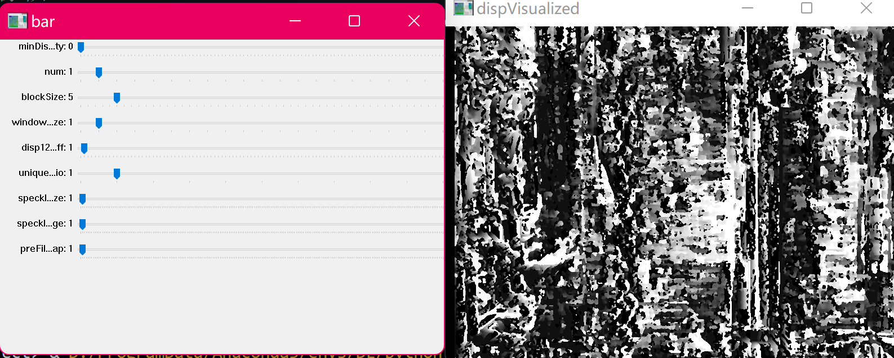


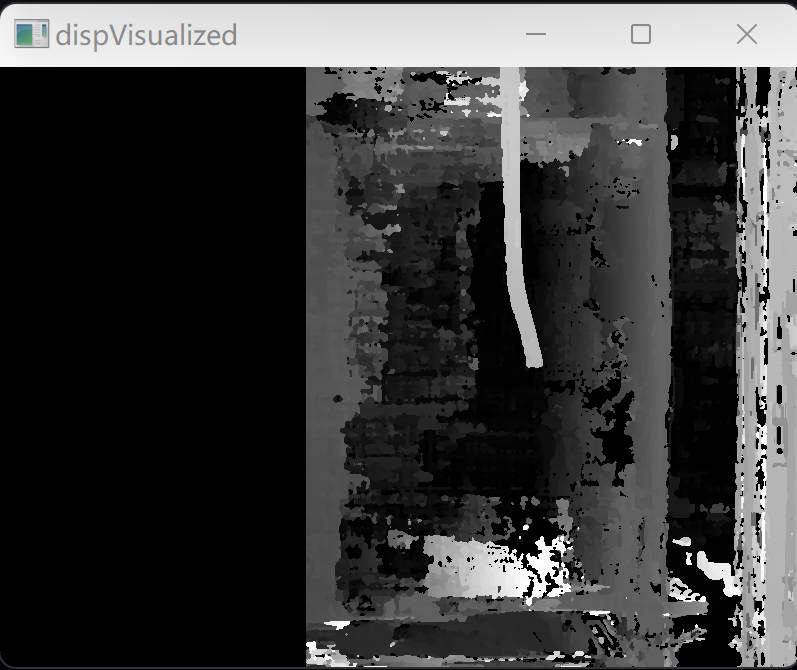

可以看到调参后的视差图中背景仍然十份嘈杂，这是因为背景本身的纹理就比较模糊，匹配器很难匹配，但是由于我们只需要导管的三维信息就可以了，导管的视差是准确清晰即可。


在得到视差图后，就可以使用==Stereo_Vision.py==中的另一个函数==get_point_cloud() #EE3F4D==从视差图中计算三维点云了

## 八、特征提取

我们无需对相机拍到的所有内容进行重建，因此我们要对导管进行分割，获得导管上的一系列点，最后从三维点云中选择导管上的点即可。

由于工作环境、光照条件基本是稳定的，而且还添加了黑色的背景进行对比，因此完全可以直接对图像进行二值化，或者先进行一次颜色识别，再二值化。

在==Params.py==中定义了全局变量的类:

``` python
class GlobalPara:
    def __init__(self, ROILeftP1, ROILeftP2, lower, upper) -> None:
        """
        全局参数类，用于存储一些参数

        Args:
            ROILeftP1: 左图像感兴趣区域的左上角坐标
            ROILeftP2: 左图像感兴趣区域的右下角坐标
            lower: HSV 颜色空间的下界
            upper: HSV 颜色空间的上界
        """
        ROIxleftP1, ROIyleftP1 = int(ROILeftP1[0]), int(ROILeftP1[1])  # 左上角坐标
        ROIxleftP2, ROIyleftP2 = int(ROILeftP2[0]), int(ROILeftP2[1])  # 右下角坐标

        self.ROILeftP1 = [ROIxleftP1, ROIyleftP1]
        self.ROILeftP2 = [ROIxleftP2, ROIyleftP2]

        self.lower = lower  # HSV 颜色空间的下界
        self.upper = upper  # HSV 颜色空间的上界
```

其中包含了ROI区域， 以及颜色识别的上下界。在==main.py==中我们初始化这个类:

``` python
GP = P.GlobalPara(ROILeftP1=[320, 100], ROILeftP2=[620, 500],
                  lower=np.array([0, 0, 180]), upper=np.array([120, 40, 255]))
```


接着就要用到==Feature_Extraction.py==了，主要用到这个文件中的两个函数：

``` python
def HSV_segmentation(RGBimage, lower, upper, mask) -> object:
    """
    对RGB图像进行HSV颜色空间分割

    Args:
        RGBimage: 输入的RGB图像
        lower: HSV的下界
        upper: HSV的上界
        mask: 分割掩码

    Returns:
        output: 分割结果图像
    """
    input = RGBimage.copy()

    # 使用掩码进行图像位与操作
    input = cv2.bitwise_and(input, input, mask=mask)

    # 将图像转换为HSV颜色空间
    HSVimage = cv2.cvtColor(input, cv2.COLOR_BGR2HSV)

    # 根据HSV下界和上界进行分割
    output = cv2.inRange(HSVimage, lower, upper)

    # 对分割结果进行膨胀操作
    kernel = np.ones((7, 7), np.uint8)
    output = cv2.dilate(output, kernel, iterations=1)

    # 对分割结果进行腐蚀操作
    kernel = np.ones((3, 3), np.uint8)
    output = cv2.erode(output, kernel, iterations=2)

    return output


def Centerline_Extraction(SEGimage) -> object:
    """
    提取中心线

    Args:
        SEGimage: 分割图像

    Returns:
        skeleton: 中心线图像
        target: 中心线上的目标点坐标
    """
    input = SEGimage.copy()

    finished = False
    size = np.size(input)
    skeleton = np.zeros(input.shape, np.uint8)
    initialsize = cv2.countNonZero(input)
    zeros = initialsize

    while (not finished):
        kersize = 3
        kernel = cv2.getStructuringElement(cv2.MORPH_CROSS, (kersize, kersize))

        eroded = cv2.erode(input, kernel)
        temp = cv2.dilate(eroded, kernel)
        temp = cv2.subtract(input, temp)

        skeleton = cv2.bitwise_or(skeleton, temp)
        input = eroded.copy()

        zeros = size - cv2.countNonZero(input)
        if zeros == size:
            finished = True

    # 对中心线进行膨胀操作
    kernel = np.ones((3, 3), np.uint8)
    skeleton = cv2.dilate(skeleton, kernel, iterations=2)

    # 对中心线进行腐蚀操作
    kernel = np.ones((3, 3), np.uint8)
    skeleton = cv2.erode(skeleton, kernel, iterations=2)

    # 获取中心线上的目标点坐标
    target = np.where(skeleton == 255)
    target = np.array(target).T

    return skeleton, target


```

==HSV_segmentation(RGBimage, lower, upper, mask) #EE3F4D==负责颜色识别并且返回二值化的图像，其中用到了掩码mask，也就是我们定义的ROI区域

Centerline_Extraction(SEGimage)则是对二值化的图像进行骨架提取，用到的方法也比较简单，就是连续的进行腐蚀操作，直到图像中不再有像素点为止，那么上一次腐蚀的图像就是骨架了。这个函数会返回两个变量，skeleton则是提取好的骨架，target则是骨架对应的二维点集。

接着我们要用到同一个文件中的==getTargetPoints(frameLeft, GP: P.GlobalPara, imgOriginal=None, debug=False) #EE3F4D==函数将这些函数结合起来：

``` python
def getTargetPoints(frameLeft, GP: P.GlobalPara, debug=False):
    """
    获取目标点集

    Args:
        frameLeft: 左摄像头图像帧
        GP: 全局参数
        debug: 是否开启调试模式
        imgOriginal: 原始图像（用于调试）

    Returns:
        covP: 目标点集
    """
    imgL_rectified = cv2.remap(frameLeft, P.mapLx, P.mapLy, cv2.INTER_LINEAR)

    maskLeft = np.zeros(imgL_rectified.shape[:2], dtype=np.uint8)
    maskLeft[GP.ROILeftP1[1]:GP.ROILeftP2[1], GP.ROILeftP1[0]:GP.ROILeftP2[0]] = 255

    SEGimage = HSV_segmentation(imgL_rectified, GP.lower, GP.upper, mask=maskLeft)

    SKEimage, TargetPoints = Centerline_Extraction(SEGimage)

    start = np.argmin(TargetPoints[:, 0])
    start = TargetPoints[start]

    covP = COV.convolution(SEGimage, start=start, size=[20, 20], step=10, max_pixels=30, debug=debug)

    if debug:
        combinedOut = np.hstack([SEGimage, SKEimage])
        cv2.namedWindow('SEG&SKEcombinedOut', cv2.WINDOW_AUTOSIZE)
        cv2.resizeWindow('SEG&SKEcombinedOut', 1600, 600)
        cv2.imshow('SEG&SKEcombinedOut', combinedOut)

    return covP
```

我们首先进行HSV颜色识别得到**SEGimage**，然后对**SEGimage**进行骨架提取得到**SKEimage**，接下来的操作则是对**SKEimage**图像进行卷积(代码中用的是**SEGimage**，其实用**SKEimage**的计算量会小一些)

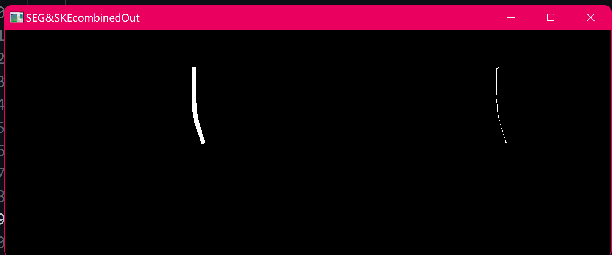

最后一步对图像进行了卷积，那么这个卷积操作的含义是什么呢？

## 九、卷积降维操作

查看==Convolution.py==文件

``` python
import numpy as np
import cv2
import math

class vector:
    def __init__(self, x, y):
        self.x = x
        self.y = y
    
    def __add__(self, other):
        return vector(int(self.x + other.x), int(self.y + other.y))
    
    def __sub__(self, other):
        return vector(int(self.x - other.x), int(self.y - other.y))
    
    def __mul__(self, other):
        return vector(self.x * other, self.y * other)
    
    def __str__(self):
        return "vector: x = %d, y = %d" % (self.x, self.y)
    
    def length(self):
        return int(math.sqrt(self.x**2 + self.y**2))


def convolution(image_conv, start, size, step, max_pixels, debug=False):
    """
    卷积函数，用于提取目标点集

    Args:
        image_conv: 输入图像
        start: 起始点坐标
        size: 区域大小
        step: 步长
        max_pixels: 最大像素数
        debug: 是否开启调试模式
        imgOriginal: 原始图像（用于调试）

    Returns:
        result: 目标点集
    """
    result = []

    startPoint = vector(start[1], start[0])
    lastOriMeanVec = startPoint

    region = image_conv[int(startPoint.y-size[0]/2):int(startPoint.y+size[0]/2), int(startPoint.x-size[1]/2):int(startPoint.x+size[1]/2)]

    if debug:
        cv2.namedWindow("region", cv2.WINDOW_NORMAL)
        cv2.resizeWindow("region", 100, 100)

    while(np.array(np.where(region != 0)).shape[1] > max_pixels):
        region_mean = np.array(np.where(region != 0))
        if region_mean.shape[1] == 0:
            break
        region_mean = region_mean.mean(axis=1).astype(int)
        region_meanVec = vector(region_mean[1], region_mean[0])
        ori_meanVec = vector(startPoint.x-size[1]/2, startPoint.y-size[0]/2) + region_meanVec
        point = [ori_meanVec.y, ori_meanVec.x]
        result.append(point)

        if debug:
            cv2.imshow("region", region)

        forwardVec = ori_meanVec - lastOriMeanVec
        lastOriMeanVec = ori_meanVec
        forwardVec = vector((forwardVec.x*step / forwardVec.length()),int(forwardVec.y*step / forwardVec.length()))

        startPoint = ori_meanVec + forwardVec

        region = image_conv[int(startPoint.y-size[0]/2):int(startPoint.y+size[0]/2), int(startPoint.x-size[1]/2):int(startPoint.x+size[1]/2)]

    return result

```


通俗的来讲，就是先规定一个起点startPoint和一个卷积核，从起点开始卷积操作，在卷积前计算当前卷积核中的图像重心，第一次卷积时向x轴正方向走一步，然后更新重心位置，以两次重心位置计算向量，下次移动卷积核的时候就会根据这个向量进行移动，这样就相当于沿着导管进行了卷积，得到了一系列的重心所组成的点集。

为什么要进行这一步呢？我们经过骨架提取后得到的target点集已经可以用来三维重建了，但是该集合中的点的数量很多，约300个左右，然而表征一根导管在空间中的走向，只需要沿着导管的十几个点就可以了，设置合理的卷积核大小以及合理的步长，通过卷积操作就可以将300多个点降到十几个点(covP)。


## 十、可视化

接着我们提取三维点云中covP对应的点集拿出来进行可视化，结果如下:


## 十一、题外：三角测量

当你标定完之后，不确定自己的内参是否正确，可以使用手动标点同时进行三角测量来验证，三角测量不需要进行立体矫正，特征点匹配等操作，用到的函数如下：

``` python
def distance(x, y):
        l = 0.0
        x = np.array(x, dtype=float)
        y = np.array(y, dtype=float)
        for i in range(3):
                l += (x[i]-y[i])**2
        return math.sqrt(l) 

def uv2xyz(cor):
			# 函数参数为左右相片同名点的像素坐标，获取方式后面介绍
			# lx，ly为左相机某点像素坐标，rx，ry为右相机对应点像素坐标, lx = ()
        lx, ly, rx, ry = cor[0], cor[1], cor[2], cor[3]
		
        mLeft = np.hstack([np.eye(3), np.array([[0],[0],[0]], dtype=float) ])
        mLeftM = np.dot(K1, mLeft)
		
        mRight = np.hstack([R, T])
        mRightM = np.dot(K2, mRight)
		
        A = np.zeros(shape=(4, 3))
        for i in range(0, 3):
                A[0][i] = lx * mLeftM[2, i] - mLeftM[0][i]
        for i in range(0, 3):
                A[1][i] = ly * mLeftM[2][i] - mLeftM[1][i]
        for i in range(0, 3):
                A[2][i] = rx * mRightM[2][i] - mRightM[0][i]
        for i in range(0, 3):
                A[3][i] = ry * mRightM[2][i] - mRightM[1][i]
        B = np.zeros(shape=(4, 1))
        for i in range(0, 2):
                B[i][0] = mLeftM[i][3] - lx * mLeftM[2][3]
        for i in range(2, 4):
                B[i][0] = mRightM[i - 2][3] - rx * mRightM[2][3]
        XYZ = np.zeros(shape=(3, 1))
        # 根据大佬的方法，采用最小二乘法求其空间坐标
        cv2.solve(A, B, XYZ, cv2.DECOMP_SVD)
        print("空间坐标/mm ", XYZ)
        return XYZ

if __name__ == "__main__":
			# right
			# Clicked at position (x=402, y=888)
			# Clicked at position (x=1168, y=849)
			# left
			# Clicked at position (x=643, y=895)
			# Clicked at position (x=1384, y=830)
        point1 = uv2xyz(np.array([643, 895, 402, 888], dtype=float)*5)
        point2 = uv2xyz(np.array([1384, 830, 1168, 849], dtype=float)*5)
        print("两点之间距离为：", distance(point1, point2))
```

注意好R和T该用在哪里，因为大多数都是以左图作为基准，因此要对右图进行R和T的变换，因此左图的R和T就全都是标准矩阵了

接下来选择左图和右图的两对对应点，计算其三维空间的点point1和point2，并且计算这两个三维点之间的距离，再手动测量，看看是否准确。

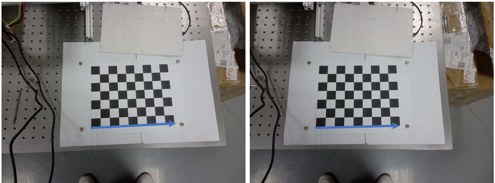

棋盘格的每一个方块的长度是25mm，9个一共225mm，最终的测量结果如下：

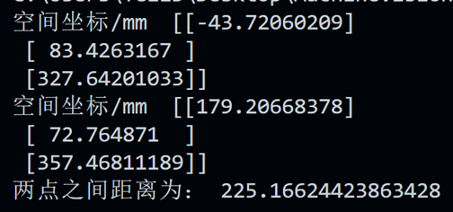

测量结果为225.16mm，已经很接近真实距离了。


## 十二、总结

可以看到可视化的结果中有比较严重的抖动，目前还没有用任何滤波。也没有用任何优化方法提高帧率，如果不开可视化的话基本上有20帧，开了的话就卡在5帧以内了，但是这些都是后话了，基本任务已经完成。

💫💫
